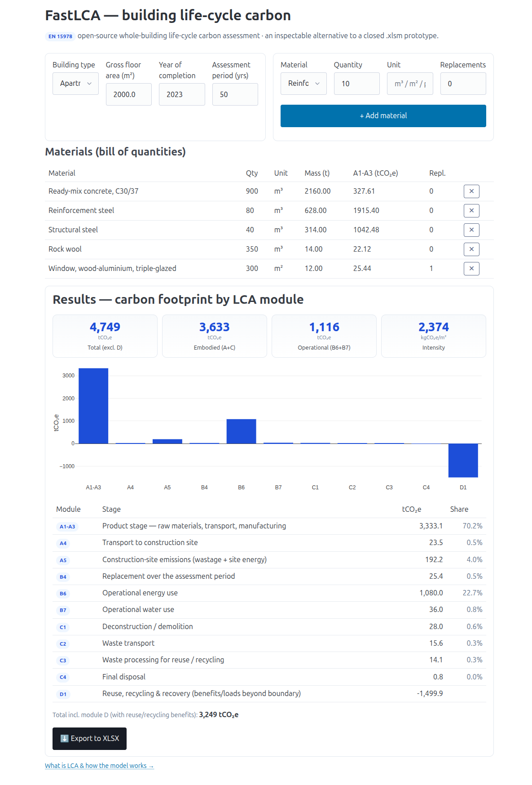

# FastLCA

**Open-source, whole-building life-cycle carbon assessment (EN 15978) as a live web app.**

FastLCA is a small [FastHTML](https://fastht.ml) application that computes a building's carbon
footprint across the full set of **EN 15978 / EN 15804 life-cycle modules** — `A1-A3 … D` — from a
bill of quantities and a handful of building parameters. It is an **inspectable, multi-user,
API-friendly alternative to a closed macro-spreadsheet**: every emission factor and every formula
lives in readable Python + JSON, not in locked VBA.

It was built as an open reference implementation alongside Lithuania's **Building Data Bank
(Pastatų Duomenų Bankas, PDB) / Building Life-Cycle subsystem (SGC IS)**, whose methodology
prototype ships as a 20-sheet `.xlsm` workbook. FastLCA reproduces that methodology in the open.



---

## What is LCA?

**LCA = Life Cycle Assessment** (sometimes *Life Cycle Analysis*). It is a standardized,
science-based methodology (guided by the **ISO 14040 / 14044** standards) that evaluates the
environmental impacts of a product, process, project, or technology **across its entire life
cycle** — from raw-material extraction (*"cradle"*), through production, use, and end-of-life
disposal or recycling (*"grave"*).

In the **built-environment** context (this app), LCA quantifies a building's greenhouse-gas
emissions — expressed as **carbon-dioxide equivalents, CO₂e** — module by module:

| Stage | Modules | What it covers |
|-------|---------|----------------|
| **Product & construction** | `A1-A3`, `A4`, `A5` | Raw materials, transport to site, site works & wastage |
| **Use** | `B1–B7` | Use, maintenance, repair, replacement, operational energy & water |
| **End of life** | `C1–C4` | Demolition, waste transport, processing, disposal |
| **Beyond the boundary** | `D1–D2` | Reuse, recycling, energy recovery, exported energy (benefits/loads) |

### LCA in the carbon-credit context

The same methodology underpins **carbon credits** — verified reductions or removals of CO₂e:

- **Quantifying net carbon benefits** — LCA calculates the full emissions footprint to determine
  how many credits a project (reforestation, biochar, carbon capture, renewable energy) can
  generate, including direct, indirect (supply-chain) and avoided emissions.
- **Ensuring additionality & integrity** — it helps prove a project delivers *real, additional*
  climate benefit beyond a business-as-usual baseline.
- **Supporting certification & MRV** — registries and standards (e.g. for biochar or carbon-removal
  projects) require a robust LCA alongside Measurement, Reporting & Verification.
- **Avoiding greenwashing** — by accounting for emissions across the *full* life cycle (e.g. the
  steel in a wind farm, or supply-chain transport), it prevents over-crediting.

**LCA vs. carbon footprint:** a carbon footprint is narrower (GHG emissions only); LCA is broader
(resource use, water, biodiversity) but usually *includes* a carbon footprint as one impact
category. In carbon markets, LCA is how you derive a **life-cycle carbon intensity** (e.g. for
fuels or removal technologies). Examples: **biochar / Direct Air Capture** projects use LCA to
certify credits by assessing emissions from production, application and long-term storage;
**nature- and tech-based removals** model cradle-to-grave impacts to estimate net removals.

---

## Why not just use the spreadsheet?

The reference prototype is a macro-enabled Excel workbook (`.xlsm`). That is fine as a *methodology
reference*, but a poor *production system*:

| Closed `.xlsm` prototype | FastLCA (open web app) |
|--------------------------|------------------------|
| Single-user file, emailed around | Multi-user, one source of truth |
| Logic hidden in VBA macros | Every formula readable in `lca/model.py` |
| No API, no integration | Clean routes + XLSX export; embeddable |
| Factors buried in cells | Factors in versioned `data/*.json` |
| Hard to audit / test | Plain Python, unit-testable |
| Proprietary lock-in | MIT-licensed, forkable |

FastLCA still **exports to XLSX**, so it drops into existing spreadsheet workflows.

---

## Quick start

```bash
pip install -r requirements.txt
python main.py
# open http://localhost:5001
```

Pick a building type, set the floor area / year / assessment period, add materials from the
factor database with their quantities (and any mid-life replacements), and the results panel
updates live: a per-module bar chart, a breakdown table (tCO₂e + share of total), embodied vs.
operational split, intensity per m², and a one-click **XLSX export**.

## How the model works

- **`data/materials.json`** — 25 construction materials with GWP factors
  (`total / fossil / biogenic / luluc`, kgCO₂e/kg), densities and wastage %, seeded from the PDB
  prototype.
- **`data/building_types.json`** — per-type operational defaults (energy kWh/m², water m³/m²,
  demolition kg/m²).
- **`data/defaults.json`** — transport distances, grid/heat emission factors, end-of-life shares.
- **`lca/model.py`** — pure functions turning a `Building` + `MaterialLine`s into tCO₂e per module.
- **`lca/export.py`** — the XLSX writer.
- **`main.py`** — the FastHTML UI (HTMX-driven, live recompute).

> **Note on factors.** The material GWP values come from the ministry's prototype; densities,
> operational intensities and end-of-life factors are transparent, editable defaults for
> demonstration. For a certified assessment, replace them with project-specific EPD data and
> national-methodology values — all in `data/*.json`, no code change.

## Project layout

```
FastLCA/
├── main.py                 # FastHTML app (UI + routes)
├── lca/
│   ├── model.py            # EN 15978 computation
│   └── export.py           # XLSX export
├── data/
│   ├── materials.json      # material GWP factor database
│   ├── building_types.json # operational defaults per building type
│   └── defaults.json       # transport / grid / end-of-life factors
├── static/css/style.css
├── docs/user_guide.md
└── requirements.txt
```

## License

[MIT](LICENSE) © Predictive Labs. Built with [FastHTML](https://fastht.ml).
